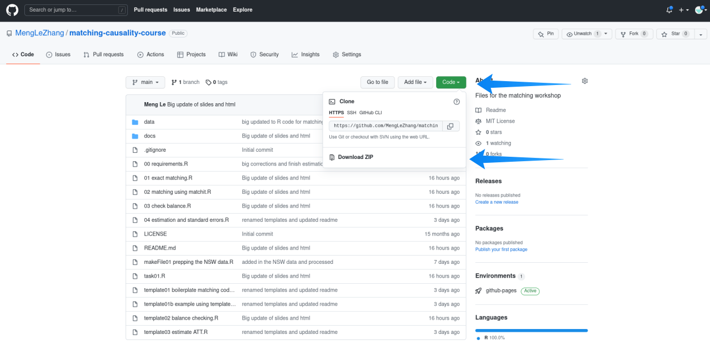

# matching-workshop
Author: Meng Le Zhang

# How to use?

What stuff is:
- start with 00 requirements.R to check you have the right packages
- raw course notes are in /docs. Vist the cheatsheet at: https://menglezhang.github.io/matching-causality-course/matching-cheatsheet.html
- code used for demoing just begin with a number (01, 02, etc)
- boilerplate code for copy+pasting+tweaking begins with the name template (template01 etc)
- data used for the course begins

Download as zip from github

# Exercise
Calculate several estimates for the treatment effect from the NSW using the data in the /data folder:
- makefile01 NSW+controls no outcome.rds
- makefile01 NSW+controls outcome only.rds

The outcome is wages in 1978 (re78) and the program is described in /docs

Do not use the file:
- makefile01 NSW complete.rds (if I forgot to get rid of it)

Save them and have a think about which treatment effects are the most credible. Ask yourself why:
- [ ] Do not base this on the effect size you see (i.e. effect on re78)
- [ ] read docs/data-readme (https://menglezhang.github.io/matching-causality-course/data-readme.html)
- [ ] check difference in the pre-treatment outcome re75
- [ ] check balance statistics
- [ ] use any other methodological knowledge you may have
