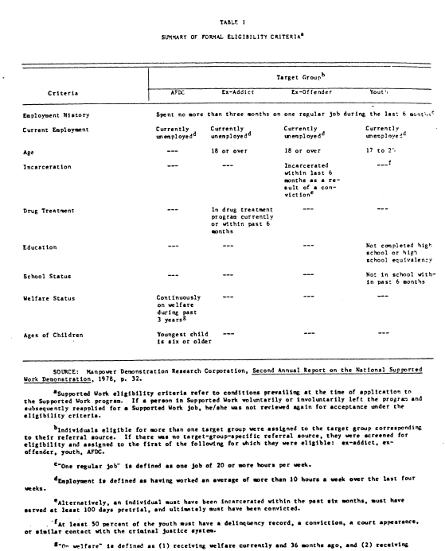

# What is the National Supported Work (NSW) Demonstration?

The NSW was a US program conducted between 1975 and 1979. It provided high structured work experience for individuals who faced economic and social problems prior to enrollment in the program. Some participants experience on the job training lasting between nine months and a year. NSW was aimed at four groups of people with severe employment disadvantages:
- Female AFDC recipients (Aid to Families with Dependent Children; available to families with low or no income) (25% of participants)
- ex-drug addicts (21%)
- ex-offenders (35%)
- young school dropouts (19%)

Further eligibility criteria include a lack of attachment to the labour force defined as:
1. Person was unemployed before selection. Defined as working less than 40 hours in the preceding four weeks.
2. Person spent not more than 3 months on one regular job with at least 20 hours per week in preceding six months

Additional criteria for each group are given in this table (MDRC User guide p.6):

The program was run in fifteen sites across the US including Atlanta, Chicago, Hartford, Jersey City, Newark, New York, Oakland, Philadelphia, San Francisco, and Wisconsin.

Enrollment took place between April 1975 and July 1977. Participants applied to be in the program (due to walk-in or referrals).

Data from the NSW comes from the official evaluation program. The program costs $9,100 per AFDC participant and $6,800 per participant for the other group.

The data used for this course on a subset of participants who were:
- male (i.e. no AFDC group)
- not lost to attrition
- enrolled after December 1975
- no longer participating by 1978 (e.g. finished or dropouted out)

__Population Survey of Income Dynamics (PSID)__: A random US population survey of household heads. This is where data from the control group comes from. Only male respondents are in this subset.

Data source:

Hosted by Dehejia:
https://users.nber.org/~rdehejia/data/.nswdata2.html

References:

Dehejia, Rajeev H, and Sadek Wahba. ‘Causal Effects in Nonexperimental Studies: Reevaluating the Evaluation of Training Programs’. Journal of the American Statistical Association 94, no. 448 (1999): 11.

Lalonde, Robert J. ‘Evaluating the Econometric Evaluations of Training Programs with Experimental Data’. American Economic Review 76, no. 4 (1986): 604–20. https://doi.org/10.1017/CBO9781107415324.004.

Manpower Demonstration Research Corporation. National Supported Work Evaluation Study, 1975-1979: Public Use Files. Inter-university Consortium for Political and Social Research [distributor], 2009-02-02. https://doi.org/10.3886/ICPSR07865.v2
