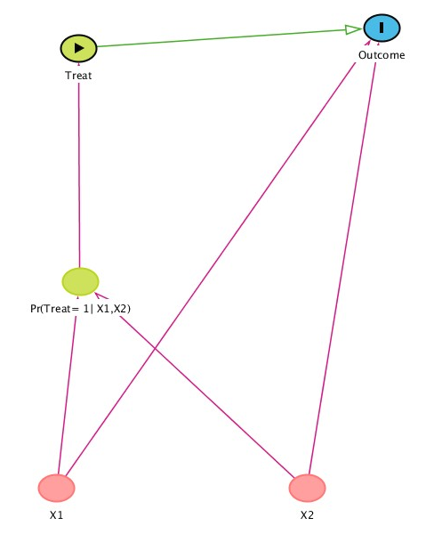

Previously we did exact matching
- coarsened exact matching
- propensity score

What method to match (most useful for propensity score)
- nearest neighbour
  - max matches?
  - calipers
  - greedy vs optimal

Filtering and common support
- discarding cases

Checking balance
- QQ graphs
- rinse and repeat?

Tip: Save your matches into a list

Propensity score matching uses a special trick

idea is that two control and treatment cases can have different values of $X$ but the same probability of being treated (the true propensity score):

For example
If probability of being treat is equal to $ln(\frac {z} {1-z})$ (i.e. inverse of the logit fuction from logistic regression). If $z = x^2$ then a treatment case with $X = 1$ and a control case with $X = -1$ will have the same value of $z$ ($1^2 = -1^2 = 1$) and thuse the same propensity score.

Now we can match two cases that before we ought to have no right matching. As if magic....

Big assumptions:
- we need to know the true propensity score
Problem:
- we don't know the true propensity score most of the time.

So actually we normally use the propensity score as a useful guideline. Balancing on several variables is hard. If we match on the propensity score maybe the final matched data will also be balanced on $X_1$ 
