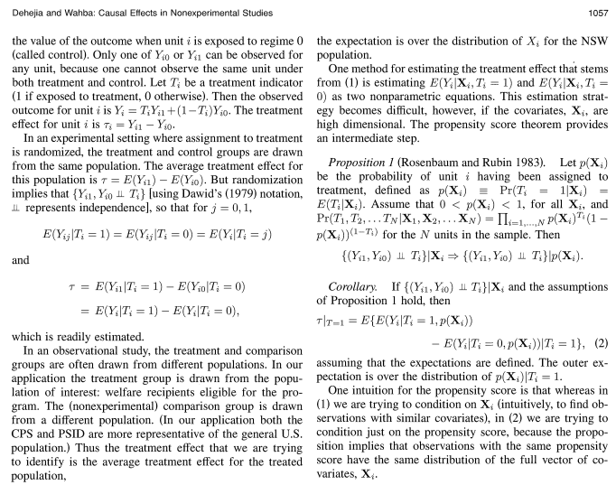

# __Who am I?__

Meng Le Zhang (meng_le.zhang@sheffield.ac.uk)

my github: https://github.com/MengLeZhang

my researchgate: https://www.researchgate.net/profile/Meng-Le-Zhang

check: 00 requirements.R for required packages

---

# Objectives

- understand what causality is about (potential outcomes framework)
- understand what matching is about
- what to do it using R

With a bonus focus on research design and credibility

## Example: Causality lingo

## Example: Matching jargon

<small> "In addition, the estimate of interest, the __average treatment effect on the treated (ATT)__..."</small>

<small> "To avoid poor matches (i.e. large differences between regenerated sites and their closest non-regenerated neighbour) a threshold on the maximum propensity score distance, __the radius__, was imposed (__radius matching__).... The sample is narrowed to the region of __common support__: regeneration sites with a propensity score higher than the maximum or less than the minimum of the control observations were discarded." </small>

# Course focus

This course focuses on:

1. The effects of causes not causes of effect

"Does school quality affect pupil performance"

not "Can the inequalities in pupil performance be explained by school quality"

2.  One type of design -- cases where all confounding is observed

3. One definition of causality (counterfactuals)

Just manage your expectations

# Set up

1. What is causal inference and lingo (30 min)
2. 15 min break + setup your computers
3. Explaining matching and the example data (30 min)
4. 15 min break + run scripts
5. Matching using MatchIt in R (30 min)
6. 30 min exercise: NSW data
7. Wrap up (30 min)

Confused? Lost track? Check out the cheatsheet

If you have IT issues; the code will be there

# Causality in a nutshell

1. Causality is about comparing 'what would happen if we did $T$' scenarios (counterfactuals)
2. Cannot observe counterfactuals (either $T$ happened or didn't)
3. Instead let's compare cases where $T$ did and did not happen

## Matching in a nutshell

1. Finding cases which are similar to each other

# Causality (30 min)

## 

---

# What is causality

- few robust ways outside of experiments
- no data or access to data
- mercy of fortune
- initially credible designs turn out junk
- rashomon effect (similar designs, conflicting results)
- credibility (watch out for reviewer 2)
- massive imposter syndrome (the above doesn't help)
- ___so so many more reasons___

Hard statistic never has to be a reason

## __Making things easier__

"_If your experiment needs statistics, you ought to have done a better experiment_"

- get a good design first and foremost
- try ideas quickly and often -- fail faster, avoid sunken cost fallacy
- be really honest with yourself about your work
- get a brain trust (people who will give you honest feedback)
- avoid assumptions of convenience

---

__Matching assumption__
2FsCpQLBADsAPwAAPwEjIiY0NjsBNyMiJjQ2OwE3PgEyFg8BMzc
