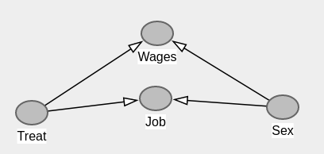

# __Who am I?__

- Meng Le Zhang (meng_le.zhang@sheffield.ac.uk)

- my github: https://github.com/MengLeZhang

- my researchgate: https://www.researchgate.net/profile/Meng-Le-Zhang

- check: 00 requirements.R for required packages

---

# Objectives

- understand what causality is about (potential outcomes framework)
- understand what matching is about
- what to do it using R

## Example: Causality lingo

## Example: Matching jargon

<small> "In addition, the estimate of interest, the __average treatment effect on the treated (ATT)__..."</small>

<small> "To avoid poor matches (i.e. large differences between regenerated sites and their closest non-regenerated neighbour) a threshold on the maximum propensity score distance, __the radius__, was imposed (__radius matching__).... The sample is narrowed to the region of __common support__: regeneration sites with a propensity score higher than the maximum or less than the minimum of the control observations were discarded." </small>

# Course focus

- 1. The effects of causes not causes of effect

  - "Does school quality affect pupil performance"
  - not "Can the inequalities in pupil performance be explained by school quality"

- 2.  One type of design -- cases where all confounding is observed

- 3. One definition of causality (counterfactuals)

# Set up

1. What is causal inference and lingo (30 min)
2. 15 min task / break
3. Explaining matching using MatchIt (30 min)
4. 15 min task / break
5. Matching using MatchIt in R (30 min)
6. 30 min exercise: NSW data
7. Wrap up (30 min)

Confused? Lost track? Check out the cheatsheet

If you have IT issues; the code will be there

# Causality

# Causality and potential outcomes

## Potential outcomes

- __counterfactual__: "relating to or expressing what has not happened or is not the case"

The effects of X on Y:

- Does more education lead to better pay?

Rephrase that as a counterfactual:

- There is a parallel world I didn't have a degree. Would my wages be any different?

## Potential outcomes

Imagine these worlds:

- world A = I got a degree (real world)
- world B = I didn't a degree (counterfactual)
- If my wages were differred between A and B then a degree had an effect.

- Causal effect is the difference between my outome and my potential outcome under a counterfactual (hence __potential outcome framework__)

## Potential outcomes

- We cannot observe potential outcomes. But imagine we could:

|           | Sex |   | Outcome world A (if treated) | Outcome world B (if not treated) | Is actually treated? | Outcome (in real life) |
|-----------|-----|---|----------------------|--------------------------|----------------------|------------------------|
| Liam.     | M   |   | 1                    | 0                        | T                    | 1                      |
| Noah.     | M   |   | 1                    | 1                        | F                    | 1                      |
| Oliver.   | M   |   | 0                    | 0                        | T                    | 0                      |
| Amelia.   | F   |   | 1                    | 0                        | F                    | 0                      |
| Isabella. | F   |   | 0                    | 1                        | T                    | 0                      |
| Mia.      | F   |   | 1                    | 0                        | F                    | 0                      |

# Treatment effects (ATE, ATT, ATU)

|           | Sex |   | Outcome world A (if treated) | Outcome world B (if not treated) | Is actually treated? | Outcome (in real life) |
|-----------|-----|---|----------------------|--------------------------|----------------------|------------------------|
| __Liam.__     | M   |   | 1                    | 0                        | T                    | 1                      |
| Noah.     | M   |   | 1                    | 1                        | F                    | 1                      |
| __Oliver.__   | M   |   | 0                    | 0                        | T                    | 0                      |
| Amelia.   | F   |   | 1                    | 0                        | F                    | 0                      |
| __Isabella.__ | F   |   | 0                    | 1                        | T                    | 0                      |
| Mia.      | F   |   | 1                    | 0                        | F                    | 0                      |

<small>__Average treatment effect (ATE)__ Average difference in outcomes between world A and B (treated vs not treated) for the entire sample </small>

<small> $$\frac{(1-0)+ (1-1)+(0-0) + (1-0)+(0-1) + (1-0)}6 = 1/3$$</small>

## Treatment effects (ATE, ATT, ATU)

|           | Sex |   | Outcome world A (if treated) | Outcome world B (if not treated) | Is actually treated? | Outcome (in real life) |
|-----------|-----|---|----------------------|--------------------------|----------------------|------------------------|
| __Liam.__     | M   |   | 1                    | 0                        | T                    | 1                      |
| Noah.     | M   |   | 1                    | 1                        | F                    | 1                      |
| __Oliver.__   | M   |   | 0                    | 0                        | T                    | 0                      |
| Amelia.   | F   |   | 1                    | 0                        | F                    | 0                      |
| __Isabella.__ | F   |   | 0                    | 1                        | T                    | 0                      |
| Mia.      | F   |   | 1                    | 0                        | F                    | 0                      |

<small>__Average treatment effect on the treated(ATT)__ Average difference in outcomes between world A and B (treated vs not treated) for only those that __ACTUALLY__ received the treatment in real life (Liam, Oliver, Isabella) </small>

<small> $$\frac{(1-0)+ (0-0) + (0-1)}3 = 0$$</small>

## Treatment effects (ATE, ATT, ATU)

|           | Sex |   | Outcome world A (if treated) | Outcome world B (if not treated) | Is actually treated? | Outcome (in real life) |
|-----------|-----|---|----------------------|--------------------------|----------------------|------------------------|
| __Liam.__     | M   |   | 1                    | 0                        | T                    | 1                      |
| Noah.     | M   |   | 1                    | 1                        | F                    | 1                      |
| __Oliver.__   | M   |   | 0                    | 0                        | T                    | 0                      |
| Amelia.   | F   |   | 1                    | 0                        | F                    | 0                      |
| __Isabella.__ | F   |   | 0                    | 1                        | T                    | 0                      |
| Mia.      | F   |   | 1                    | 0                        | F                    | 0                      |

<small>__Average treatment effect on the Untreated (ATU)__ Average difference in outcomes between world A and B (treated vs not treated) for only those that __did not__ received the treatment in real life (Noah, Amelia, Mia) </small>

<small> $$\frac{(1-1)+(1-0)+ (1-0)}3 = 2/3$$</small>

## Treatment effects (ATE, ATT, ATU)

Why care? They are different quantities

- Imagine a free school meals as a treatment
- Children who are treated may have high benefits (i.e. low income families)
- Children who are not treated may have no benefits (i.e middle income families)
- The ATE is just a weighted version of the ATT and ATU (depending on population of treated and untreated)

- Note: In randomised experiments with equal samples, ATE = ATT = ATU

## Example: Matching jargon

<small> "In addition, the estimate of interest, the __average treatment effect on the treated (ATT)__..."</small>

# Estimating causality

- Estimands, estimators, and estimates
- Randomisation as an estimator

## Estimands, estimators, and estimates

- ATT, ATE and ATU are __estimands__. The goal of our research.
- Our guesses for the ATT, ATE and ATU are __estimates__
- The method we use are __estimators__

## Estimands, estimators, and estimates

Example: Estimand (L) versus Estimate (R).

## Randomisation as an estimator

|           | Sex |   | Outcome world A (if treated) | Outcome world B (if not treated) | Is actually treated? | Outcome (in real life) |
|-----------|-----|---|----------------------|--------------------------|----------------------|------------------------|
| __Liam.__     | M   |   | 1                    | 0                        | T                    | 1                      |
| Noah.     | M   |   | 1                    | 1                        | F                    | 1                      |
| __Oliver.__   | M   |   | 0                    | 0                        | T                    | 0                      |
| Amelia.   | F   |   | 1                    | 0                        | F                    | 0                      |
| __Isabella.__ | F   |   | 0                    | 1                        | T                    | 0                      |
| Mia.      | F   |   | 1                    | 0                        | F                    | 0                      |

- ATE = Mean outcome in world A $(\mu_A)$ - Mean outcome in world B $(\mu_B)$
- Randomise who gets sent to world A and B (i.e. who is actually treated)
- Sample mean of treated is an unbiased __estimator__ for $\mu_A$
- Sample mean of untreated is an unbiased __estimator__ for $\mu_B$
- The difference between the two is an unbiased __estimate__ for the ATE

## Randomisation as an estimator

|           | Sex |   | Outcome world A (if treated) | Outcome world B (if not treated) | Is actually treated? | Outcome (in real life) |
|-----------|-----|---|----------------------|--------------------------|----------------------|------------------------|
| __Liam.__     | M   |   | 1                    | 0                        | T                    | 1                      |
| Noah.     | M   |   | 1                    | 1                        | F                    | 1                      |
| __Oliver.__   | M   |   | 0                    | 0                        | T                    | 0                      |
| Amelia.   | F   |   | 1                    | 0                        | F                    | 0                      |
| __Isabella.__ | F   |   | 0                    | 1                        | T                    | 0                      |
| Mia.      | F   |   | 1                    | 0                        | F                    | 0                      |

- When we deliberately randomise this is an __experiment__.

- When the randomisation occurs without an intent to do an experiment, it is a __natural experiment__.

## Randomisation as an estimator

# Non-random selection

- Receiving the treatment is not random. This isn't a problem unless there are confounders.

- __Confounder__: A common cause of i) treatment status and ii) your outcome.

- Example: Poverty is a common cause of free school meals and absenteeism.

# Matching

- Non-random selection is not an issues if:
- 1. we observe __every confounder__
- 2. we do not try to adjust for __colliders__

## Confounders

If we observe __every confounder__ (call it $X$) then we can for the ATT:

- match every treatment case to a control case with identical $X$
- calculate the difference in outcomes between matched pairs

This is an unbiased estimate of the ATT

## Colliders

Never ever match on __colliders__.

__Collider__: In most cases, a collider is a common effect of both your treatment and another variable that affects your outcome. It's complicated....

This is the reason why people tell you never to condition on post-treatment outcomes....

## Colliders

- Estimand: Effect of treatment on Wages
- Job is a collider; never condition on this (e.g. through regression or matching)

# Summary

- Counterfactuals and potential outcomes
- Treatment effects (ATE, ATT, ATU)
- Randomisation
- Confounders and colliders

## Golden rules

- 1. We observe __every__ __confounder__ (or almost every)
- 2. Don't condition on __colliders__

- If these conditions are met, causal inference is easy peasy....

- ... but getting the conditions just right is 90% of the task

"If your experiment needs statistics, you ought to have done a better experiment."

# The National Supported Work (NSW) Demonstration data

- US program conducted between 1975 and 1979
- Work experience for individuals who faced economic and social problems
- job training lasting between nine months and a year.
- non-treatment cases come from a population survey (PSID)
- very influential study (explain later)

Task: What was the treatment effect (ATT) of the NSW program?

## The National Supported Work (NSW) Demonstration data

- Person was unemployed before selection

- NSW was aimed at four groups of people with severe employment disadvantages:
  - Female AFDC recipients (Aid to Families with Dependent Children; available to families with low or no income) (25% of participants)
  - ex-drug addicts (21%)
  - ex-offenders (35%)
  - young school dropouts (19%)

## The National Supported Work (NSW) Demonstration data

- We only have males in the sample. The outcome is:
  - wages in 1978 (re78) (in separate file)

- more info here: (https://menglezhang.github.io/matching-causality-course/data-readme.html)

# Task

Open the NSW data and use whatever technique you know to estimate the treatment effect

Pick some estimates you __believe__ and let us know what they are

Take 15 minutes

We'll come back and discuss them

## Task

Are we really just the artist who drew the picture on the right?
