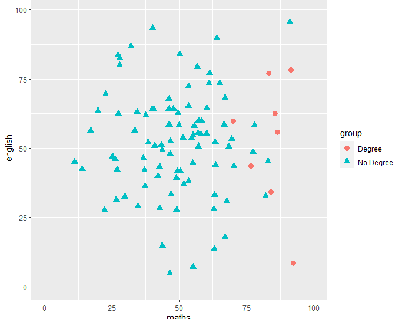
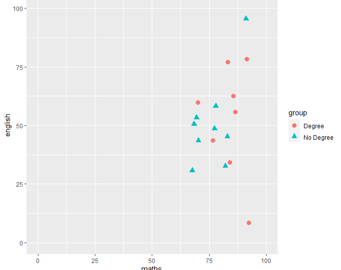
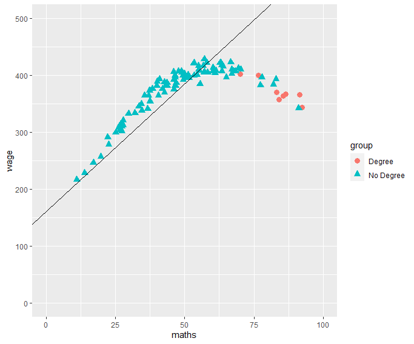
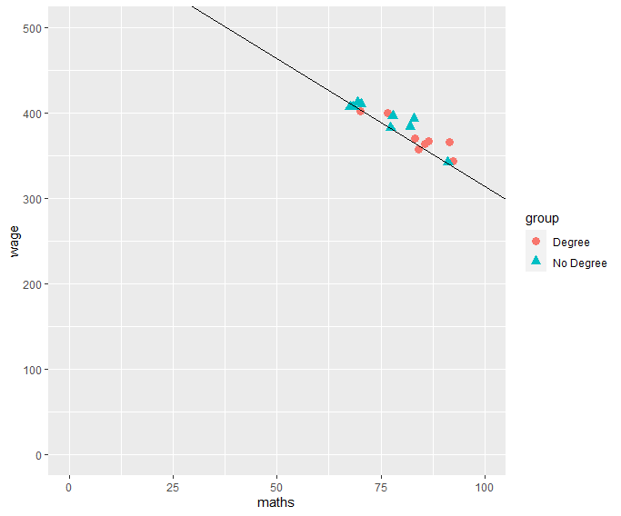

# The National Supported Work (NSW) Demonstration data

- US program conducted between 1975 and 1979
- Work experience for individuals who faced economic and social problems
- Person was unemployed before selection
- job training lasting between nine months and a year.
- NSW was aimed at four groups of people with severe employment disadvantages:
  - Female AFDC recipients (Aid to Families with Dependent Children; available to families with low or no income) (25% of participants)
  - ex-drug addicts (21%)
  - ex-offenders (35%)
  - young school dropouts (19%)

We only have males in the sample. The outcome is:
- wages in 1978 (re78) not inclued straight away

- more info here: (https://menglezhang.github.io/matching-causality-course/data-readme.html)

# The National Supported Work (NSW) Demonstration data

- non-treatment cases come from a population survey (PSID)
- very influential study (explain later)

Task: What was the ATT of the NSW program?

# Matching

Assumption: You observe all confounders $X$

Goal: Match treatment cases with similar control cases based on $X$

Steps:

1. Defining “closeness”: the distance measure used to determine whether an individual is a good match for another,

2. Implementing a matching method, given that measure of closeness,

3. Assessing the quality of the resulting matched samples, and perhaps iterating with Steps (1) and (2) until well-matched samples result, and

4. Analysis of the outcome and estimation of the treatment effect, given the matching done in Step (3).

## Matching

## Matching

# Advantages over just modelling

Why not just use [insert model here]?

Most modelling approaches assume:

- all confounders are observed
- the model is correct

'Wrong' models (e.g. wrong functional form) can still give the right results if:

- the treatment and control group have identical characteristics (treatment is uncorrelated with confounders)

## Safer assumptions (doubly robust)

Linear regression: wage = treat + maths

Estimated diff: - 88 (SE: 13.8)

## Safer assumptions (doubly robust)

Linear regression: wage = treat + maths

Estimated diff: -0.66 (SE: 7.78)

## Exact matching

Run through 01 using exact matching

# Nearest neighbour matching

# Safer assumptions (doubly robust)

Linear regression: wage = treat + maths

Estimated diff: - 88 (SE: 13.8)

## Safer assumptions (doubly robust)

Linear regression: wage = treat + maths

Estimated diff: -0.66 (SE: 7.78)

## Safer assumptions (doubly robust)

Assuming all confounders $X$ are observed. A regression model is correct if either:
1. Treatment $T$ is uncorrelated with $X$
2. We know have modelled the data right (e.g. functional form assumptions)

## Safer assumptions (doubly robust)

In theory matching + modelling is good because:

1. Matching ensures $T$ is uncorrelated with $X$ (as much as possible)
2. Where matches are not perfect, modelling can fill in the gaps

---

---

# What is causality

- few robust ways outside of experiments
- no data or access to data
- mercy of fortune
- initially credible designs turn out junk
- rashomon effect (similar designs, conflicting results)
- credibility (watch out for reviewer 2)
- massive imposter syndrome (the above doesn't help)
- ___so so many more reasons___

Hard statistic never has to be a reason

## __Making things easier__

"_If your experiment needs statistics, you ought to have done a better experiment_"

- get a good design first and foremost
- try ideas quickly and often -- fail faster, avoid sunken cost fallacy
- be really honest with yourself about your work
- get a brain trust (people who will give you honest feedback)
- avoid assumptions of convenience

---
