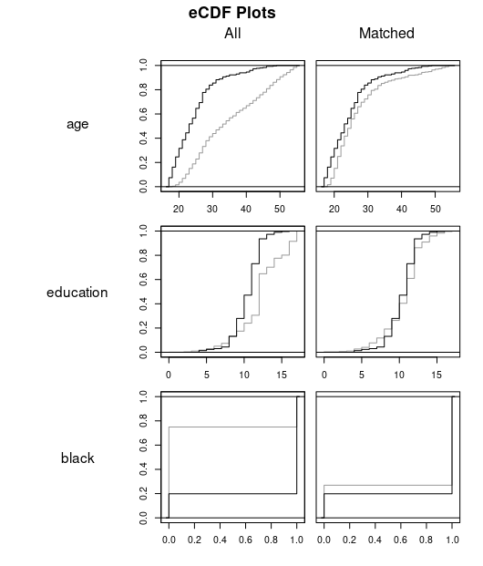

# Matching

- Assumption: You observe all confounders $X$
- Goal: Match treatment cases with similar control cases based on $X$ (avoid colliders)

- Ideal outcome: Distribution of $X$ is identical between treatment and control groups (balanced)

## Matching steps

- 0. Omit the outcome variable from the data. Pick your $X$ based on design.

- 1. Defining “closeness”: the distance measure used to determine whether an individual is a good match for another,

- 2. Implementing a matching method, given that measure of closeness,

- 3. Assessing the quality of the resulting matched samples, and perhaps iterating with Steps (1) and (2) until well-matched samples result, and

- 4. Analysis of the outcome and estimation of the treatment effect, given the matching done in Step (3).

# Advantages over just regression

- Why not just use [insert model here]?

- Most modelling approaches assume:

  - 1. all confounders are observed
  - 2. the model is correct

## Advantages over just regression

- 'Wrong' models (e.g. wrong functional form) can still give the right results if:

  - the treatment and control group have identical characteristics (treatment is uncorrelated with confounders)

- Balancing the sample beforehand guards against incorrect models

## Advantages over just regression

- Matching doesn't always work perfectly (some imbalance)
- Modelling can fill in the gaps (so long as extrapolation error is reasonable)

## Doubly robust example

- Linear regression: wage = treat + maths
- Treatment effect: - 88 (SE: 13.8) [Real effect = 0]

## Doubly robust example

- Linear regression: wage = treat + maths
- Estimated diff: -0.66 (SE: 7.78) [Real effect = 0]

# MatchIt (R package)

- Suite of matching functions for matching
- Collects various functions from other packages as well
- Fantastic documentation: `use vignette('MatchIt')`

Daniel E. Ho, Kosuke Imai, Gary King, Elizabeth A. Stuart (2011). MatchIt: Nonparametric Preprocessing for Parametric Causal Inference. Journal of Statistical Software,
Vol. 42, No. 8, pp. 1-28. https://doi.org/10.18637/jss.v042.i08

# Step zero: Avoid data mining

- Pick your matching covariates $X$ based on your design
- Ground your choices in facts not convenient assumptions
- Take your outcome variable out of the data before matching

# Step one: Define closeness

- Exact
- Nearest neighbour (1:1; one to one)
- Nearest neighbour (K:1; many to one)
- Other algorithms

## Exact matching

- Exact = Treatment and control matched on exact values of $X$
- Example: If age and sex are covariates. A treatment 19 year old male will be matched only to  of schooling
- Easily done by grouping your data into subclasses

## Exact matching

- Pros:
- Best method. Always try this first.
- What all other matching methods aspire to
- __Guarantees__ balance on $X$

- Cons:
- Lots of unmatched cases in many scenarios (e.g. using continuous variables)
- So old it's new. Reviewers may not have heard of it (not a joke).

## Nearest neighbour (1:1)

- Exact = too strict.
- Nearest neighbour = Based on a distance measure (next section). Get the nearest control case to the treatment
- Means to an end; the idea is to hope that the data is balanced afterward

## Nearest neighbour (1:1)

- Pros:
- Potentially better trade-off between bias and efficiency than exact matching
- Really easy to do and explain

- Cons:
- doesn't guarantee balance
- 1:1 matching is inefficient compared to other methods. Maybe result is less statistical power than exact matching
- Once a control case is used as a match; should we reuse? If so order matters

## Nearest neighbour (K:1)

- Same as 1:1 nearest neighbour matching but with multiple controls matched per treatment
- $K$ is the maximum number of matches

## Nearest neighbour (K:1)

- Pros:
- same as 1:1 nearest neighbour

- Cons:
- same as 1:1 nearest neighbour
- potentially worse balance

## Example

## Example

# Step 2: Define 'closeness' (distance)

- Exact matching
- Mahalanobis distance
- Propensity score

## Exact

- Nothing to say here; either cases are identical or not
- Curse of dimensionality (impractical with multiple $X$)

## Mahalanobis distance

- Like Euclidean distance but account for correlation between multiple $X$ and standardises variances
- Example: Euclidean distance is bad if $X_1$ is measures in 1000s and $X_2% in 10s
- Example: Euclidean distance is bad if $X_1$ and $X_2% are heavily correlated whilst $X_3$ isn't

- Cases with the exact same values of $X$ will have a distance of zero

## Propensity score

- Curse of dimensionality: Multiple $X$
- What if we could just summarise all this info into one statistic
- Propensity score = Estimated probability of being in the treatment

- Disclaimer: Propensity score here is used as a means to an end (i.e. balance).

## Propensity score

- Propensity score = Estimated probability of being in the treatment
- How to estimate?
- 1. Run a model (your choice, example: logistic regression with $X$)
- 2. Get the predicted probability. This is propensity score
- 3. Match

- Cases with the exact same values of $X$ will have the same propensity score

# 3. Diagnostics: Check balance and other statistics

Goal: Balance treatment and control groups on $X$

- Common support
- Summary statistics
- Check graphs

## Common support

- matching require some overlaps in $X$
- Example: If you match on sex, some members of your treatment and control must be either male of female.
- Example: All treatment cases are male, all controls are female. You cannot disentangle the effect of participant sex from the treatment effect.
- Can pre-filter to just cases where there is some overlap

- `discard` option in `matchit()`

## Summary statistics

- Balance means that the distribution of $X$ ought to be identical
- Hard to test but we can check summary statistics
- __Standardised difference in means__: Difference in means adjusted for standard deviation (goal: 0)
- __Variance ratio__: treatment group variance divided by control variance (goal: 1)
- __empirical Cumulative Distribution Function (eCDF) mean, variance etc__ We want all this to be 0

## Standardised difference in mean

- Vertical lines = 0.1 and 0.05 respectively. You want the matched data to end up within the lines

## QQ plots

## eCDF plots

## Remember to check multivariate statistics

## What to do if balance isn't good enough

- Official guidance is to iterate and reiterate until balance is good enough.
- Play with more advanced options

## More options

- To prevent poor matches,  we can introduce a __caliper__ = maxmimum difference between matches.
-  A __caliper__ of 10% means that matched pair matches cannot have a propensity score difference of more than 10%
- Reduce number of matches in K:1 matching (K = 4 is a good upper limit)
- Do exact matching on some variables first (e.g. split sample into males and females then do propensity score matching)

## Automated matching anyone?

- Coarsened Exact Matching: Like exact matching but uses a rule to create coarsened covariates (think age bands instead of exact ages). Then uses exact matching on the coarsened covariates.
- Genetic matching: Kind of magic. Does a whole series of iterative steps to maximise balance.
- There are a lot of other options ....
- Remember: This is all a means to an end... Balance is key

## Example: Matching jargon

<small> "To avoid poor matches (i.e. large differences between regenerated sites and their closest non-regenerated neighbour) a threshold on the maximum propensity score distance, __the radius__, was imposed (__radius matching__).... The sample is narrowed to the region of __common support__: regeneration sites with a propensity score higher than the maximum or less than the minimum of the control observations were discarded." </small>

- Here __radius__ means caliper matching

# 4. Estimation

- Get your outcome variable (omitted in step zero)
- Pick whatever model or technique you were going to use
- Add your matching covariates
- Add weights
- Get correct standard errors

## Modelling after matching

- See examples in 04.R
- Always remember to add in weights and matching covariates

## Modelling after matching

## Correct standard errors

- If in doubt use cluster robust standard errors
- Example: In 1:1 match, each matched pair is a subclass/ cluster. Adjust for this.
- Check cheatsheet

# 5. Posthoc tests

- Robustness tests: Outcome pre-treatment, Placebos
- Get inventive here -- I can't make this up for you
- Remember: The tougher the test is to pass; the more credible your results

# Task 2

- Repeat task 1 but use matching first
- Play around with technique (see cheat sheet) until you are satisfied
- Copy and paste template code (template01 etc)
- What are your new results?
